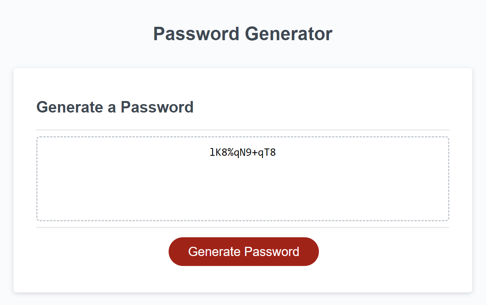
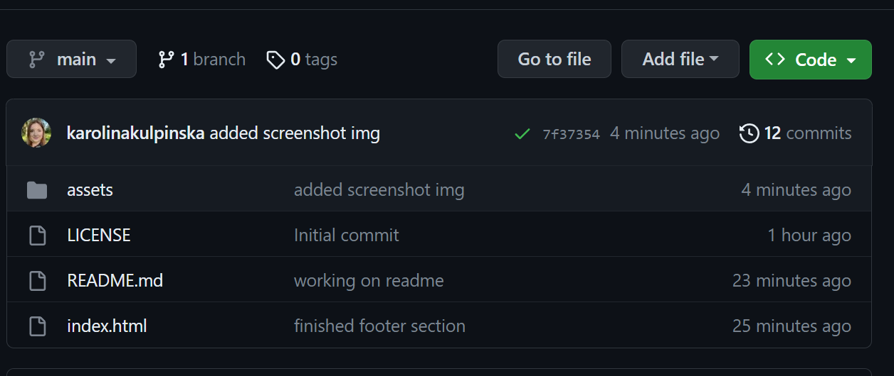
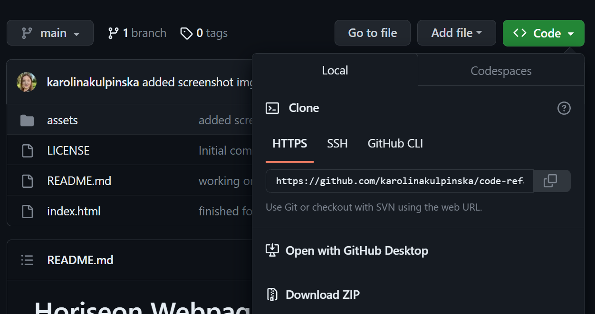

# Random Password Generator

## Descritpion

This week’s challenge required of me to create an application that can be used to generate a random password based on user's criteria. The app runs in the browser, and features dynamically updated HTML and CSS powered by JavaScript code that I wrote. 

This challenge's criteria included:
* Generate a password when the button is clicked
  * Present a series of prompts for password criteria
    * Length of password
      * At least 8 characters but no more than 128.
    * Character types
      * Lowercase
      * Uppercase
      * Numeric
      * Special characters ($@%&*, etc)
  * Code should validate for each input and at least one character type should be selected
  * Once prompts are answered then the password should be generated and displayed in an alert or written to the page

I've made sure that the application:
* loads with no errors;
* is deployed at live URL;
* resembles the example functionality provided in the challenge instructions.

As well as repository:
* follows best practices for file structure and naming conventions;
* follows best practices for variable naming conventions, indentation, quality commentary, etc;
* contains multiple descriptive commit messages, contains quality README file with description, screenshot, and link to deployed application.

Link to deployed application: https://karolinakulpinska.github.io/password-generator/

## Screenshot of the final result



## Installation

Please follow the steps below to access code and install the project:

1. Access https://github.com/karolinakulpinska/password-generator
2. Above the list of files, click on green 'Code' button.

3. Copy the URL of the repository.
- To clone the repository using HTTPS, under "HTTPS", click two files button.

- To clone the repository using an SSH key, including a certificate issued by your organization's SSH certificate authority, click SSH, then click two files button.
- To clone a repository using GitHub CLI, click GitHub CLI, then click two files button.
4. Open Terminal/Git Bash.
5. Change the current working directory to the location where you want the cloned directory.
6. Type `git clone`, and then paste the URL you copied earlier.

```
$ git clone https://github.com/karolinakulpinska/password-generator.git
```

7. Press Enter to create your local clone.

```
$ git clone https://github.com/karolinakulpinska/password-generator.git
> Cloning into `password-generator`...
> remote: Counting objects: 10, done.
> remote: Compressing objects: 100% (8/8), done.
> remove: Total 10 (delta 1), reused 10 (delta 1)
> Unpacking objects: 100% (10/10), done.

```

## Usage

The user can utilize this app to generate a random password based on criteria they've selected by answering prompts (number of characters: 8 - 128, uppercase characters, lowercase characters, numbers, special characters). The app prints the generated password in the textbox, which then can be copied.

## Licence

MIT License

Copyright (c) 2023 Karolina Kulpinska 

Permission is hereby granted, free of charge, to any person obtaining a copy
of this software and associated documentation files (the "Software"), to deal
in the Software without restriction, including without limitation the rights
to use, copy, modify, merge, publish, distribute, sublicense, and/or sell
copies of the Software, and to permit persons to whom the Software is
furnished to do so, subject to the following conditions:

The above copyright notice and this permission notice shall be included in all
copies or substantial portions of the Software.

THE SOFTWARE IS PROVIDED "AS IS", WITHOUT WARRANTY OF ANY KIND, EXPRESS OR
IMPLIED, INCLUDING BUT NOT LIMITED TO THE WARRANTIES OF MERCHANTABILITY,
FITNESS FOR A PARTICULAR PURPOSE AND NONINFRINGEMENT. IN NO EVENT SHALL THE
AUTHORS OR COPYRIGHT HOLDERS BE LIABLE FOR ANY CLAIM, DAMAGES OR OTHER
LIABILITY, WHETHER IN AN ACTION OF CONTRACT, TORT OR OTHERWISE, ARISING FROM,
OUT OF OR IN CONNECTION WITH THE SOFTWARE OR THE USE OR OTHER DEALINGS IN THE
SOFTWARE.